# CoMind 使用与原理指南

CoMind 是基于 Electron 的智能办公与学习助手，把截图问答、网页采集、资料管理、会议转写和 AI 模拟面试放在同一个桌面工作空间中。模型由用户配置，资料和会话保存在本机；需要推理或转写时，相关内容会发送到对应模型服务。

本文按仓库当前实现编写，更新于 **2026-09-22**。面向首次使用者、开发者和需要了解数据流的维护者。源码：[azhsmesos/CoMind](https://github.com/azhsmesos/CoMind)。

> **截图说明**：本文图片来自真实 Electron 界面，使用临时工作空间、虚构简历和本机模拟模型生成。演示模型、回答和分数用于说明界面，不代表真实云端模型效果或真实候选人的表现。手机图是 390px 宽的 Chromium 页面，不是手机实拍。截图不包含个人密钥、真实简历或有效的共享链接。

## 阅读导航

- [1. 项目能做什么](#1-项目能做什么)
- [2. 安装与启动](#2-安装与启动)
- [3. 首次配置与权限](#3-首次配置与权限)
- [4. 工作台：提问、截图与网页采集](#4-工作台提问截图与网页采集)
- [5. 资料库与简历解析](#5-资料库与简历解析)
- [6. 模拟面试完整流程](#6-模拟面试完整流程)
- [7. 会议语音识别](#7-会议语音识别)
- [8. 悬浮窗、快捷键与手机查看](#8-悬浮窗快捷键与手机查看)
- [9. 历史、导出与本地数据](#9-历史导出与本地数据)
- [10. 技术架构与实现原理](#10-技术架构与实现原理)
- [11. 常见问题排查](#11-常见问题排查)
- [12. 开发、测试与截图维护](#12-开发测试与截图维护)

## 1. 项目能做什么

| 能力 | 入口 | 典型用途 | 使用条件或边界 |
|---|---|---|---|
| 文本问答 | 智能工作台 | 整理知识点、解释问题、生成参考回答 | 配置并启用回答模型 |
| 截图识别 | 工作台或全局快捷键 | 识别屏幕上的文字、题目、图表 | 屏幕权限；模型支持图片输入；当前直接截整屏 |
| 网页文字采集 | Chrome 扩展 | 将当前网页可读文字发送到工作台 | 扩展配对；浏览器内部页面等不可读取 |
| 资料库 | 我的资料库 | 简历、JD、固定问答、提词稿 | 解析后可编辑，保存后生效 |
| 文件解析 | 资料库、模拟面试 | PDF、Word、图片简历转可编辑文字 | 单文件不超过 20 MB，PDF 最多 10 页 |
| 会议识别 | 智能工作台 | 电脑播放声音实时转写、识别完整问题 | 当前面向 macOS；需百炼 ASR 和系统音频权限 |
| 模拟面试 | 模拟面试 | 根据简历和 JD 提问、追问、评分和生成答案 | 文字模式需要回答模型；语音另需麦克风和 ASR |
| 历史复盘 | 历史与复盘 | 回顾普通会话、分析实际作答、导出 Markdown | 有实际作答才评价个人表现 |
| 独立悬浮窗 | 工作台或快捷键 | 置顶阅读答案或提词稿 | 可调透明度、字号和鼠标穿透 |
| 手机查看 | 工作台 → 手机查看 | 同一局域网只读查看普通会话问答 | 电脑持续运行；手机与电脑网络可互访 |

当前没有独立的论文检索、引用管理、长篇论文批量解析或知识库向量检索模块。可以把论文页面截图或摘录的文字交给模型理解，但不要把「简历上传」理解为通用论文处理流程；它使用的是简历解析提示词与文件限制。

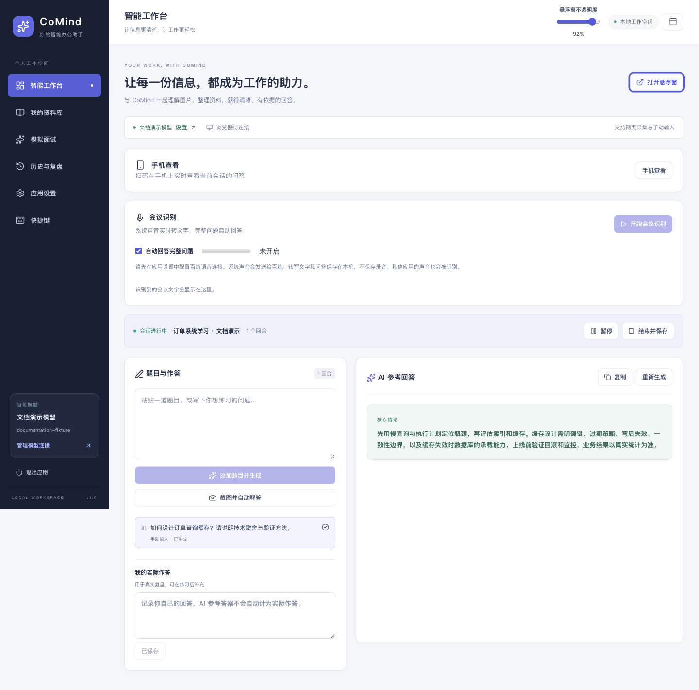

*图 1：工作台真实界面；回答来自文档演示模型。*

## 2. 安装与启动

### 2.1 使用安装包

如果已经拿到构建产物，在 `release/` 中选择对应平台和处理器的包。Mac M 系列选择 `arm64`，Mac Intel 选择 `x64`，Windows 选择 `win-x64.exe`。Mac 打开 DMG 后拖入 Applications，Windows 运行安装程序。

安装包包含 Electron 运行时，普通使用不需要 Node.js，也不需要配置 `.env`。仓库提供打包命令，并不意味着 GitHub 已经有对应版本的公开安装包。当前打包配置没有启用 macOS 开发者签名和公证，分发前应单独处理签名需求。

### 2.2 从源码启动

建议使用 **Node.js 24**，这是本项目当前开发验证使用的版本；不要使用此前出现依赖安装问题的 Node.js 18.17.0。

```bash
git clone https://github.com/azhsmesos/CoMind.git
cd CoMind

# 已安装 nvm 时使用；没有 nvm 可直接安装 Node.js 24
nvm install 24
nvm use 24

npm ci
npm run dev
```

如果已经有本地仓库，只需要进入该仓库目录后执行相应命令，不必重新克隆。先用 `node -v` 确认当前终端使用的版本。

`npm run dev` 会先构建手机页面，再启动端口为 **5180** 的 Vite 前端服务，等待前端就绪后编译并启动 Electron。首次安装可能需要下载 Electron 二进制。

### 2.3 什么情况下需要重启

| 修改内容 | 如何生效 |
|---|---|
| React 页面或样式 | 开发模式通常由 Vite 热更新 |
| `electron/` 主进程、IPC、预加载脚本 | 完整退出 CoMind，再运行 `npm run dev` |
| 手机端页面 | 重新运行开发命令或重新构建手机页面 |
| macOS 系统权限 | 授权后完整退出相关应用，必要时重启启动终端，再启动 |
| 安装版源代码 | 重新打包并安装；旧安装包不会自动更新 |

**关闭窗口不等于退出程序**：关闭主窗口通常只是进入托盘。请使用侧边栏「退出应用」或托盘「退出」。应用有单实例保护，再执行一次 `npm run dev` 可能只是唤起原进程，旧进程不会因此加载新的主进程代码。

## 3. 首次配置与权限

### 3.1 配置回答模型

进入 **应用设置 → AI 模型连接 → 添加模型**，填写服务商、配置名称、接口协议、API Base URL、模型 ID 和 API Key，保存后测试并启用。

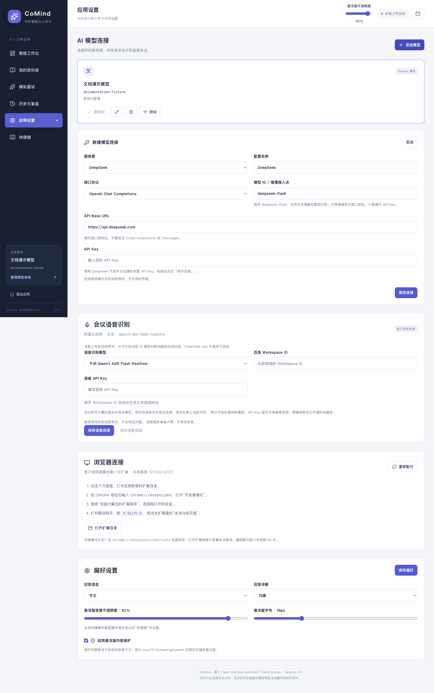

*图 2：模型配置界面。已有卡片为本机演示服务，新建表单显示项目预设值，不代表账户已经开通相应模型。*

| 字段 | 填写方式 |
|---|---|
| 配置名称 | 自己容易识别的名称，如「日常问答」「视觉模型」 |
| 服务商 | 豆包、DeepSeek、GLM，或自定义 |
| 接口协议 | 按服务商接口选择 OpenAI 兼容或 Anthropic Messages |
| API Base URL | 接口根地址，不额外附加 `/chat/completions` 或 `/messages` |
| 模型 ID | 填写自己账号已开通的模型标识；豆包也可能是推理接入点 ID |
| API Key | 对应服务商密钥；编辑已存连接时留空保留原密钥 |

第一份配置会自动启用；已有其他模型时，需要点击新模型卡片的「启用」。文本连接测试通过不代表图片输入一定可用，截图和 PDF 简历解析还需要实际验证视觉能力。项目中的预填模型名只是配置默认值，具体可用模型和权限以服务商账户为准。

### 3.2 配置语音识别

进入 **应用设置 → 会议语音识别**，填写北京地域的百炼 Workspace ID、语音 API Key，并选择已开通的模型：

- `qwen3-asr-flash-realtime`：默认选项，使用 Realtime 协议。
- `fun-asr-realtime`：使用 Inference 协议。
- `paraformer-realtime-v2`：使用 Inference 协议。

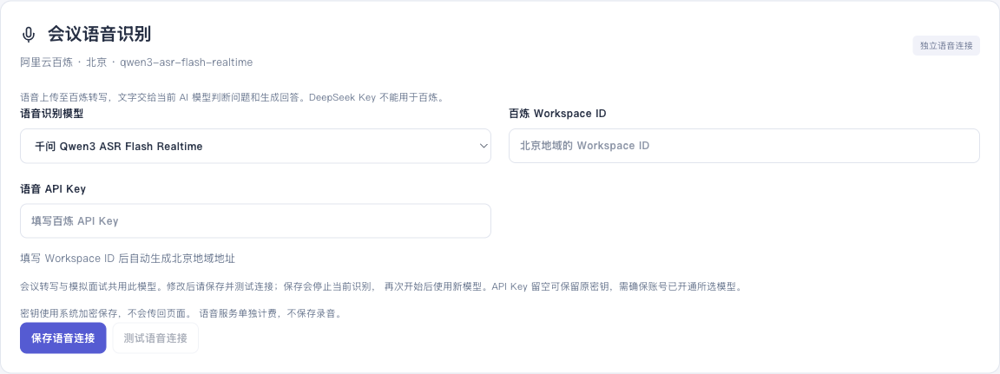

*图 3：语音配置界面；演示工作空间未填真实凭证。*

回答模型与语音模型是两套连接，DeepSeek 等回答服务的 Key 不能代替百炼 Key。系统朗读使用本地中文音色，不需要新增云端 TTS Key。保存语音配置会停止正在进行的识别，下一次启动使用新配置。

### 3.3 macOS 权限对应关系

| 功能 | 所需权限 | 开发模式可能显示的名称 |
|---|---|---|
| 截图识别 | 录屏／屏幕录制 | Electron、启动终端 |
| 会议系统声音识别 | 录屏与系统录音 | Electron、iTerm、Terminal 等实际启动应用 |
| 模拟面试语音回答 | 麦克风 | Electron 或 CoMind |
| 文字问答、文字模拟面试 | 不需要录屏或麦克风权限 | — |

在 macOS **系统设置 → 隐私与安全性** 中查看对应权限项，名称随系统版本可能不同。安装版通常显示 CoMind，开发版可能归属 Electron 或实际启动它的终端。只开麦克风权限不能解决系统音频采集；只开录屏权限也不等于允许麦克风。

如果开关已开启仍报错，应先判断实际运行的进程、应用是否已完整重启以及应用内部权限处理，不能把所有报错都归因于系统开关。相关排查见第 11 节。

## 4. 工作台：提问、截图与网页采集

### 4.1 手动提问

1. 确认左侧显示了当前使用的模型。
2. 在「题目与作答」输入问题，点击「添加题目并生成」。没有会话时会自动创建。
3. 在右侧阅读参考回答，需要时复制或重新生成。
4. 在「我的实际作答」中补充自己的回答并保存，用于后续复盘。
5. 可以暂停、继续，或「结束并保存」到历史。

普通问题展示具体答案；算法或编程实现题采用简短思路加 Java 代码的回答方式。旧答案不会因为提示词调整而自动重写，可以手动重新生成。

### 4.2 截图识别

先把目标内容显示在屏幕上，再按 **Mac `⌘+Shift+S` / Windows `Ctrl+Shift+S`**，或点击「截图并自动解答」。多显示器时，将鼠标移到目标显示器。

当前流程是：**捕获鼠标所在整屏 → 压缩图片 → 创建问答回合 → 发给当前模型 → 展示回答**。没有圈选步骤，也不会弹出蓝色框选页面。图片转换为 JPEG，长边最大 2560 像素。

整个屏幕上的可见内容都会进入图片，遮挡题目的悬浮窗也可能被截入。使用前移开遮挡，避免无关内容进入模型请求。未配置模型时仍可保留截图，配置后重试。

### 4.3 Chrome 网页采集

1. 在「应用设置 → 浏览器连接」点击「打开扩展目录」。
2. 在 Chrome 打开 `chrome://extensions`，开启开发者模式。
3. 点击「加载已解压的扩展程序」，选择应用刚打开的目录。
4. 打开目标网页，点击扩展「发送当前页面」，或使用 `⌘/Ctrl+Shift+U`。

扩展名称为「CoMind 网页助手」，首次自动配对。需要恢复配对时，先在桌面应用点击「重新配对」，再在扩展操作，配对窗口有效期为 60 秒。浏览器快捷键在 `chrome://extensions/shortcuts` 配置，和桌面全局快捷键分开管理。

浏览器内部页面、纯图片内容或无法读取的跨域 iframe 不能可靠提取文字，可改用截图。普通会话暂停时网页题目进入等待队列，最多 20 道；继续后依次处理。

## 5. 资料库与简历解析

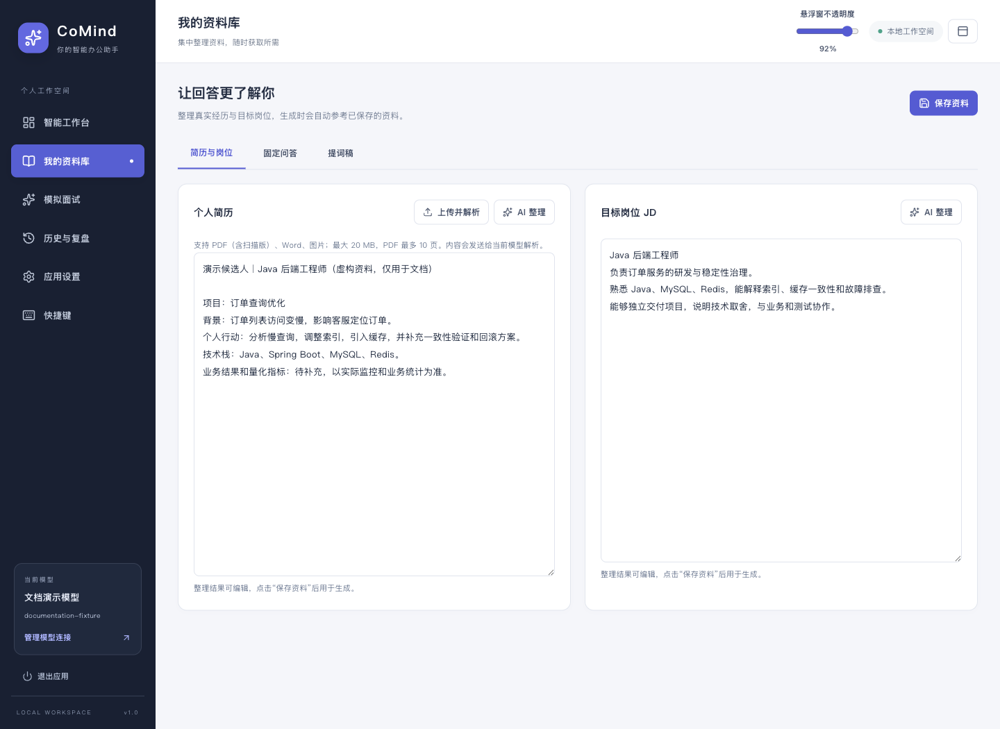

*图 4：简历、JD 可以直接编辑；示例刻意保留「待补充」指标。*

资料库包含三类内容：

| 分类 | 内容 | 使用方式 |
|---|---|---|
| 简历与岗位 | 个人简历、目标 JD | 作为普通问答背景，也可导入模拟面试 |
| 固定问答 | 常见问题和自己整理的回答 | 生成时作为参考材料 |
| 提词稿 | 演讲提纲、项目介绍、自定义文稿 | 保存后在悬浮窗选择阅读 |

上传简历支持 PDF（含扫描版）、Word `.doc/.docx`、PNG/JPEG/WebP/GIF 图片。单个文件不超过 20 MB，PDF 不超过 10 页；转换后图片还有总大小限制，页数合规但图片过大时也可能需要压缩。

解析流程：

1. **PDF**：在本地用 PDF.js 逐页渲染成图片，再交给视觉模型理解。
2. **Word**：在本地提取正文、页眉页脚和文本框等文字，再交给文本模型整理；图片形式的 Word 简历建议转成 PDF。
3. **图片**：转成适合上传的图片输入，再由视觉模型识别。
4. **确认保存**：结果写入可编辑草稿，检查姓名、时间、职责和数字后点击「保存资料」。解析失败保留原草稿。

「AI 整理」也遵循先修改草稿、再由用户保存的流程。模型解析不等于事实核验，不能把识别错误或模型补全直接当作自己的真实经历。

## 6. 模拟面试完整流程

### 6.1 准备资料和训练档位

在侧边栏进入「模拟面试」，上传简历、粘贴 JD，或点击「从资料库导入」。使用「根据 JD 识别岗位」后核对岗位，也可手动填写。

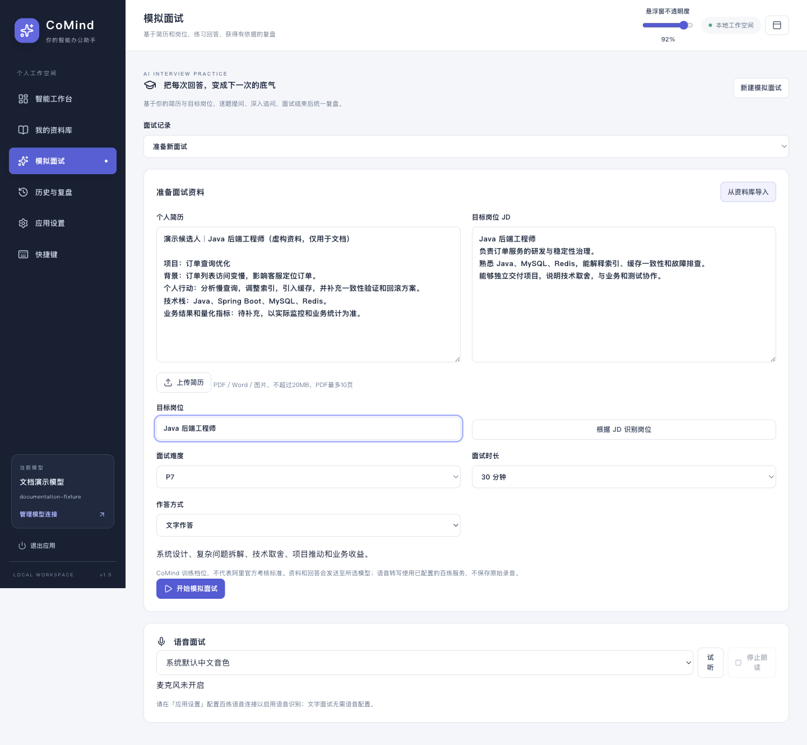

*图 5：演示选择 Java 后端工程师、P7、30 分钟和文字作答。*

| 档位 | 主要训练内容 |
|---|---|
| 阿里校招 | 基础知识、学习能力、实践过程；允许校园经历 |
| P6（默认） | 独立交付、技术深度、问题定位、工程质量 |
| P7 | 系统设计、技术取舍、复杂问题拆解、项目推动 |
| P8 | 复杂系统演进、技术规划、跨团队影响和业务战略 |

这些是 **CoMind 训练档位，不是阿里官方考核或录用标准**。时长可选 15、30、45 分钟，默认 30 分钟。面试开始时保存本场的简历、JD、岗位、难度、时长、作答方式和模型配置快照；之后修改资料库不会改写本场资料。

### 6.2 文字面试

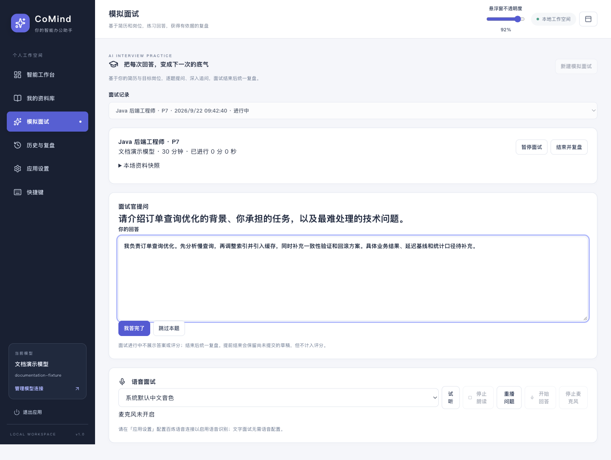

*图 6：逐题作答，进行中不显示评分和参考答案。*

1. 点击「开始模拟面试」，等待面试官生成问题。
2. 在「你的回答」填写自己的思路，点击「我答完了」提交。
3. AI 根据简历、JD、档位和已有回答继续提问；每个主问题最多两次追问。
4. 需要休息时点击「暂停面试」，恢复时点击「继续面试」；不会提前泄露答案。
5. 不会的问题可以「跳过本题」，报告标记未作答。
6. 点击「结束并复盘」，等待逐题分析和总结。到达计划时长只提醒收尾，允许完成当前回答。

结束前尚未提交的草稿会保留，但不计入已答题评分。生成下一题失败可以重试，已经提交的回答不会因为下一次请求失败而消失。

### 6.3 语音面试

先完成百炼语音配置和麦克风授权，再在准备页选择「语音面试」。系统音色菜单只展示本地中文音色，可试听、停止或重播；没有可用音色时可继续文字作答。

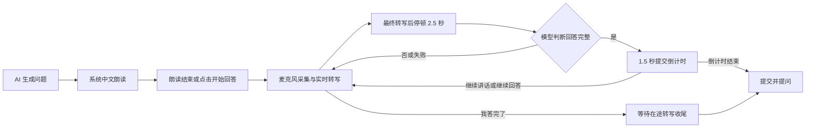

AI 播报期间不把麦克风内容当作用户回答。点击「开始回答」可以中断播报；回答转写实时出现在草稿中，用户可以校正文字。

手动提交会等待末尾转写，超时保留草稿并提示重试；空白和纯静音不会算作回答。停止麦克风后也可校正文字再提交。暂停、隐藏主窗口、切换侧栏或退出会停止模拟面试采集，重启恢复为暂停状态，不自动打开麦克风。

语音模拟面试与会议系统音频识别互斥。同一时间只能开启其中一种；它是应用内语音练习，不会创建腾讯会议、飞书会议等外部会议房间，也不保存原始录音。

### 6.4 如何阅读评分

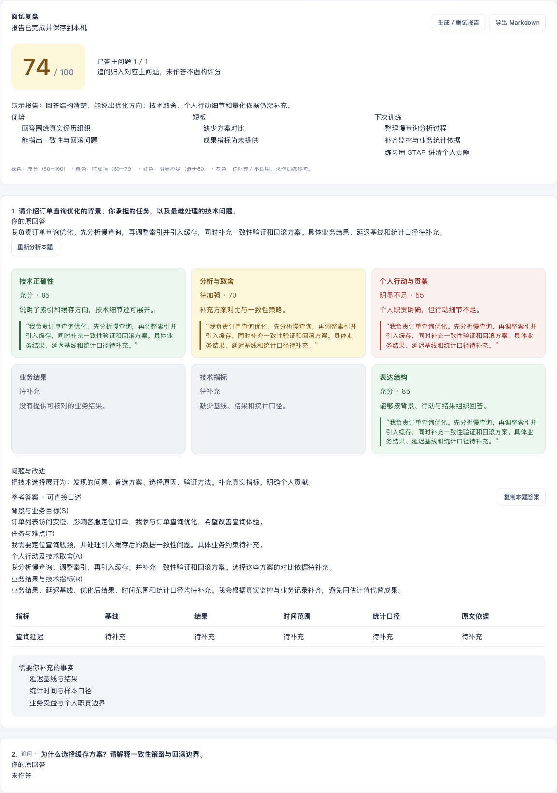

*图 7：演示报告的分数由本机固定响应生成，仅用于展示评分、待补充与未作答样式。*

| 维度 | 默认权重 | 主要关注 |
|---|---:|---|
| 技术正确性 | 25 | 原理、边界和实现是否合理 |
| 分析与取舍 | 20 | 是否比较方案、解释约束与选择 |
| 个人行动与贡献 | 15 | 自己具体做了什么，职责边界是否明确 |
| 业务结果 | 15 | 技术行动与业务目标如何关联 |
| 技术指标 | 15 | 是否有基线、结果、时间和统计口径 |
| 表达结构 | 10 | 是否有条理、清晰完整 |

绿色 **80–100「充分」**，黄色 **60–79「待加强」**，红色 **低于 60「明显不足」**。灰色是「待补充」或「不适用」，不直接当作零分。每个有分数的维度必须关联本题实际回答的原文引用，并说明理由。

单题分数 = 已评分维度的「分数 × 权重」之和 ÷ 已评分维度权重之和。证据不足和不适用维度不进入分母。例如技术 80、分析 60、其他维度均不评分时，该题为 `(80×25 + 60×20) ÷ 45 ≈ 71`。这不表示剩余能力已经通过。

主问题及其追问先汇总为一组，计算组内已评分回答的平均分，再对有分数的主问题组取平均。报告另外显示「已答主问题 / 全部主问题」；跳过题不伪造分数，因此总分要结合覆盖率和灰色维度一起看。

### 6.5 参考答案如何使用

每题分别展示「你的原回答」「问题与改进」「参考答案」。经历题按 STAR 组织：

- **S：背景与业务目标**——服务什么业务，为什么要做。
- **T：任务与难点**——自己承担的目标，以及规模、一致性、性能或协作约束。
- **A：个人行动与技术取舍**——分析过程、方案对比、实现和验证、自己的贡献。
- **R：业务结果与技术指标**——结果是什么，依据来自哪里。

技术原理题按「结论 → 原理 → 取舍 → 实例」组织，避免强行编造项目收益。指标表列出名称、基线、结果、时间范围、统计口径和原文依据。资料中没有的数据写「待补充」，应由用户依据真实记录补齐。

当前会校验评分引用是否出现在回答中、指标字段是否来自引用，并拦截经历题参考答案中未提供的阿拉伯数字。提示词也要求不得编造事实；这些机制仍不等于对所有事实和语义作外部核实，阅读后应自行校对。

逐题报告生成后立即保存。部分题目失败可「重新分析本题」，整场或汇总失败可「生成／重试报告」；成功题目会被保留。可复制单题参考答案，也可「导出 Markdown」。更简短的操作说明见 [模拟面试指南](../MOCK_INTERVIEW.md)。

## 7. 会议语音识别

工作台点击「开始会议识别」后，系统声音会被发送到百炼 ASR，最终转写保存在本机。它采集电脑播放的声音，**不启用麦克风，不只限于某个会议软件，也不做说话人分离**。耳机输出属于系统播放声音；其他应用的音频也可能进入采集。

| 项目 | 会议识别 | 模拟面试语音 |
|---|---|---|
| 音频来源 | 电脑播放的系统声音 | 麦克风中的本人回答 |
| 主要用途 | 实时转写、判断并回答完整问题 | AI 提问后用户口述作答 |
| 是否朗读问题 | 不使用模拟面试播报流程 | 系统本地中文朗读 |
| 原始音频 | 内存处理，不保存录音文件 | 内存处理，不保存录音文件 |
| 报告位置 | 普通会话的历史与复盘 | 模拟面试记录 |

开启「自动回答完整问题」后，系统合并短暂停顿和补充文字，结合最近两分钟上下文判断是否为完整提问。普通发言只转写；「介绍一下」「解释一下」等请求也可能构成问题。判断由模型完成，漏判时可点击转写旁的「作为问题回答」。

当前流程设置了断句与合并等待，自动回答串行执行，60 秒内重复问题去重；手动输入、截图和网页采集优先。待处理问题满 10 条时暂停自动回答，转写继续。断线最多按 1、2、4 秒重试三次，期间音频不补传，记录中标出转写缺口；鉴权和额度错误直接停止。

停止会议识别、暂停或结束会话、切换回答模型、退出应用等操作会停止采集及相关自动任务。主窗口进入托盘时会议识别可以继续；恢复会话或重启应用不会自动开始采集。

## 8. 悬浮窗、快捷键与手机查看

### 8.1 悬浮窗

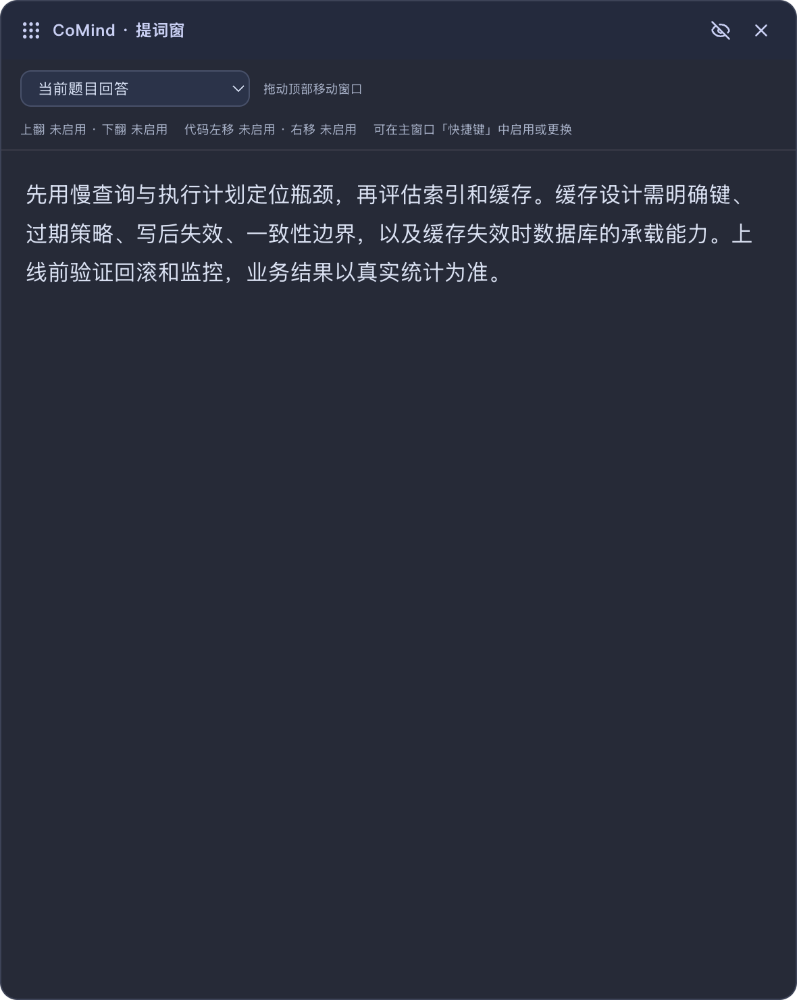

*图 8：独立悬浮窗，可以选择答案或提词稿。演示实例为避免抢占用户按键而关闭了全局快捷键。*

从工作台点击「打开悬浮窗」。可拖动标题栏、改变窗口尺寸，在主界面调透明度，在应用设置调整字号。鼠标穿透开启后，点击和滚轮交给下方应用，需要快捷键翻页或关闭穿透后操作。

内容保护的效果取决于操作系统和捕获方式，**不能保证所有录屏、屏幕共享或第三方软件都无法捕获悬浮窗，也不保证截图行为不可感知**。

### 8.2 默认快捷键

| 操作 | 默认组合 |
|---|---|
| 整屏截图并自动解答 | `Cmd/Ctrl+Shift+S` |
| 生成最新题目 | `Cmd/Ctrl+Shift+Enter` |
| 显示／隐藏悬浮窗 | `Cmd/Ctrl+Shift+B` |
| 切换鼠标穿透 | `Cmd/Ctrl+Shift+M` |
| 悬浮窗向上／向下翻页 | `Cmd/Ctrl+Alt+↑` / `Cmd/Ctrl+Alt+↓` |
| 代码向左／向右滚动 | `Cmd/Ctrl+Alt+←` / `Cmd/Ctrl+Alt+→` |
| 开放扩展重新配对 | `Cmd/Ctrl+Shift+P` |
| 退出整个应用 | `Control+C`，Mac 上是 Control，不是 Command |
| 网页扩展发送当前页面 | `Cmd/Ctrl+Shift+U`，在 Chrome 中管理 |

这是新配置的默认值，已保存的自定义配置以「快捷键」页面为准。点击输入框直接按组合键，保存后查看是否注册成功。Esc 取消录入；Backspace/Delete 清空后保存可停用。录入期间暂时停止本应用的全局快捷键。

Mac 上部分功能键需要配合 Fn，Fn 是否必需由系统键盘设置决定。遇到其他软件占用时，换组合键比反复重试同一个冲突键更有效。默认全局 `Control+C` 可能与你的终端操作冲突，可在页面清空或改成其他组合。

### 8.3 手机只读查看

电脑与手机连接同一可互访的网络，在工作台点击「手机查看」，选对局域网地址，点击「开启共享」。使用手机 Safari 或 Chrome 扫码或打开完整网址。

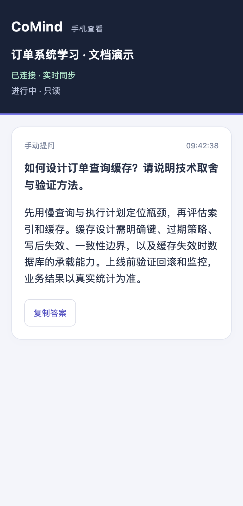

*图 9：390px 宽普通浏览器中的手机页面演示；不是实际手机或局域网连通性测试。*

手机只读展示普通会话的问答，可以翻看早期记录和复制内容，不提供提问、截图和配置修改。模拟面试内容、简历资料库、截图原图、会议全文和模型密钥不会由此自动发送；但普通答案中已经引用的个人经历仍属于答案内容。

共享使用带随机令牌的 HTTP/WebSocket 链接，最多连接 5 个页面。仅适用于可信局域网；持有完整链接的人可阅读当前共享会话。点击「重置访问链接」会断开已有连接并使旧链接失效；退出应用即停止共享，重启后需手动开启。网络地址变化后重新生成链接。

手机锁屏或转到后台可能断开，回到前台会重连并同步最近 50 条，早期记录可以继续加载。HTTP 页面的剪贴板权限可能受限制，复制失败时可选中文字长按复制。

## 9. 历史、导出与本地数据

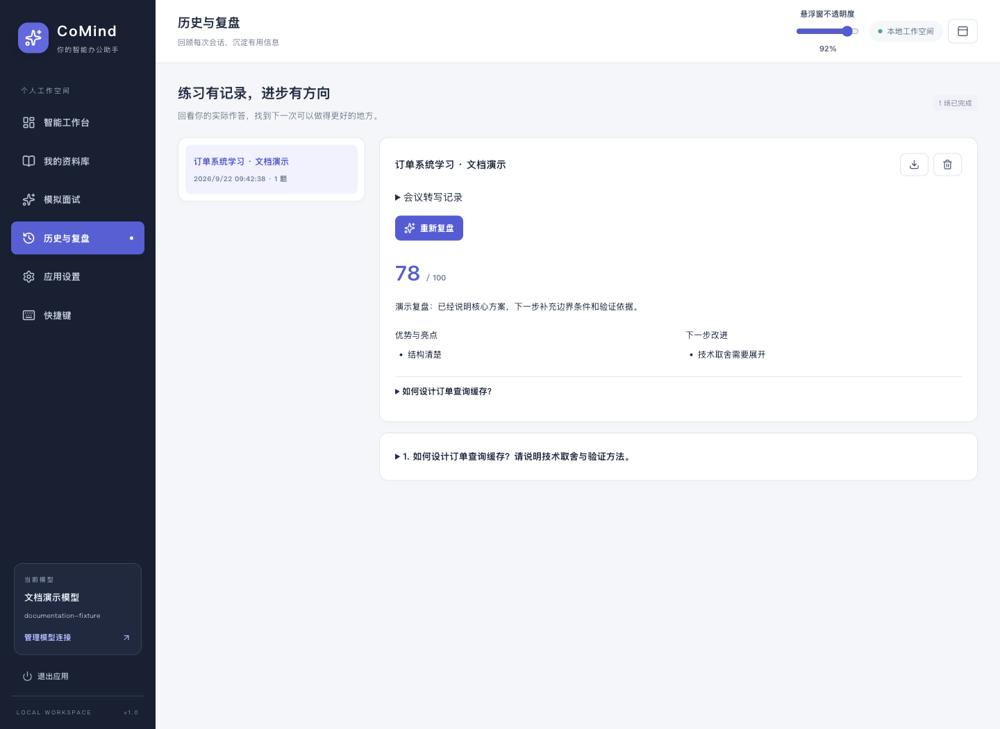

*图 10：普通会话的历史复盘；与模拟面试报告分别保存和展示。*

### 9.1 查找和导出

普通会话点击「结束并保存」后，在「历史与复盘」查看题目、参考答案、实际作答和会议转写。点击「生成 AI 复盘」分析；没有实际作答时只分析参考答案，不生成个人表现评分。通过导出按钮保存 Markdown。

模拟面试通过「模拟面试 → 面试记录」选择历史场次；导出入口在该场报告中。当前没有自动把普通历史和模拟面试报告合并的功能。

### 9.2 本地存储

| 文件或目录 | 内容 |
|---|---|
| `desktop-state.json` | 模型配置、资料库、普通会话、模拟面试及报告、偏好设置等 |
| `desktop-state.json.transcripts/` | 按会话保存的会议最终转写 JSONL 文件 |
| `screenshot.log` 及轮换文件 | 截图诊断信息；超过约 1 MB 轮换 |
| `browser-extension/` | 安装到用户数据目录的 Chrome 扩展副本 |
| 用户自行选择的导出路径 | 普通会话或模拟面试 Markdown |

数据使用 Electron 用户数据目录。已有旧版数据时，会继续使用 macOS 的 `~/Library/Application Support/小面 AI/`，这是兼容逻辑，不表示品牌未改名。新安装使用 Electron 为该安装确定的用户数据目录；开发版、安装版可能不同，应以实际运行实例为准。快捷键页会显示真实截图日志路径，可用其定位当前目录。

备份时先保存内容并完整退出应用，再复制整个实际用户数据目录。API Key 使用 Electron `safeStorage` 和操作系统能力加密；换系统或账户后可能无法解密，需要重新填写。系统加密不可用时，密钥只在当前运行内存中保留。**简历、回答和转写正文并非整体加密数据库**，备份应按个人资料管理。

### 9.3 什么会发到哪里

| 操作 | 外发内容 | 接收方 |
|---|---|---|
| 普通问答、截图识别 | 问题、必要的历史与资料、截图图片（如有） | 当前启用的回答模型服务 |
| 简历解析 | Word 提取文字，或 PDF/图片内容 | 当前启用的解析模型（复用回答配置） |
| 模拟面试与复盘 | 本场简历、JD、问题与回答 | 本场模型配置对应的服务 |
| 语音转写 | 采集到的系统音频或麦克风音频 | 已配置的百炼服务 |
| 本地系统朗读 | 由本地音色处理问题文字 | 不新增云端 TTS 服务 |
| 手机查看 | 普通会话的问题、答案、状态 | 持有效链接的局域网浏览器 |

项目没有额外的自建模型中转服务，也没有自动上传日志、遥测或自动更新逻辑。「本地保存」不等于「完全离线推理」。模型服务如何保留请求，应另行核对所选服务和账户条款。

## 10. 技术架构与实现原理

### 10.1 总体结构

技术栈为 **Electron 43、React 19、TypeScript、Vite 5**，使用版本以 [package.json](../package.json) 和锁文件为准。当前业务服务在 Electron 主进程中运行，不需要另起 Python 或 Java 后端。

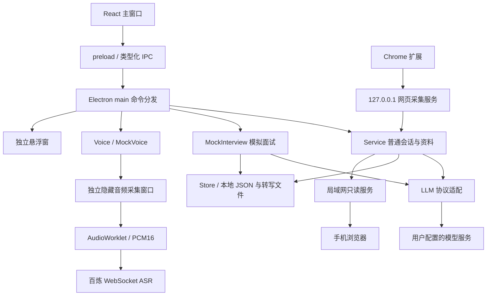

### 10.2 目录与职责

| 代码位置 | 职责 |
|---|---|
| [src/App.tsx](../src/App.tsx)、`src/components/` | 侧栏、工作台、资料库、模拟面试、报告与设置 |
| [shared/types.ts](../shared/types.ts) | 桌面状态、偏好、IPC 命令与结果类型 |
| [shared/mock.ts](../shared/mock.ts) | 模拟面试结构、训练档位、评分维度和权重 |
| [electron/main.ts](../electron/main.ts) | 创建窗口、注册快捷键、IPC 路由、权限和生命周期 |
| [electron/service.ts](../electron/service.ts) | 普通会话、问答、资料、复盘业务 |
| [electron/llm.ts](../electron/llm.ts) | OpenAI/Anthropic 请求构造、图片输入、JSON 解析和错误处理 |
| [electron/mock-interview.ts](../electron/mock-interview.ts) | 逐题提问、追问、评分校验、报告和导出 |
| [electron/mock-voice.ts](../electron/mock-voice.ts) | 语音回答、静音判断、倒计时与转写收尾 |
| [electron/voice.ts](../electron/voice.ts)、[electron/qwen-asr.ts](../electron/qwen-asr.ts) | 会议转写、自动提问队列和 ASR 协议适配 |
| [electron/audio-capture.ts](../electron/audio-capture.ts)、[src/audio-capture.ts](../src/audio-capture.ts) | 系统声音／麦克风独立采集窗口 |
| [src/pcm-worklet.js](../src/pcm-worklet.js) | 音频混音、重采样和 PCM 编码 |
| [electron/store.ts](../electron/store.ts)、[electron/transcripts.ts](../electron/transcripts.ts) | 状态与转写持久化、旧数据兼容、密钥处理 |
| [electron/DomServer.ts](../electron/DomServer.ts)、`extension/` | Chrome 配对与网页文字采集 |
| [electron/mobile-server.ts](../electron/mobile-server.ts)、`src/mobile/` | 手机只读服务与网页 |

### 10.3 IPC 与窗口隔离

主窗口通过 `window.api.command(...)` 调用受控预加载接口，主进程处理 `desktop:command`，通过 `desktop:changed` 广播状态。命令按 `model:*`、`session:*`、`voice:*`、`mock:*`、`mobile:*` 等分类。

音频窗口使用专用预加载脚本和 IPC 通道；系统声音和麦克风使用独立 session 分区，并检查请求窗口身份。系统声音采集不允许摄像头或普通麦克风请求。窗口启用 `contextIsolation` 和沙箱，页面不直接获得任意 Node.js 能力。

发送到悬浮窗的状态剔除了模拟面试记录；手机服务也只投影普通会话的有限字段。新增主窗口功能不应默认扩大这两个输出面的数据范围。

### 10.4 模型请求和异常处理

主进程根据协议把请求发到 `/chat/completions` 或 `/messages`，统一解析正文中的结构化结果。单次模型请求设有 120 秒超时，支持取消；鉴权、额度、网络、输出截断和格式错误会反馈到界面，不生成假成功结果。

模拟面试把简历、JD 和回答作为待分析资料放入请求，系统规则规定不能由资料中的指令改变面试角色。主进程串行管理面试操作，使用请求版本和 AbortController 使暂停、结束后的迟到结果失效。已经回答的题目不会被重复提交推进。

本场模型快照保存地址、协议和模型等配置，不复制明文密钥；实际请求仍通过原模型 ID 查找密钥。因此删除原模型配置后，旧场次可能无法继续生成或重试报告，需要恢复原配置。

### 10.5 音频、截图与本地服务

系统声音路径使用屏幕媒体采集获取 loopback 音轨，保持显示轨道以维持 Chromium 音频流，但音频处理代码不读取显示轨道像素。麦克风路径使用 `getUserMedia`，二者都通过 AudioWorklet 转为单声道、16 kHz PCM16 数据，再交给主进程中的 ASR 连接。

会议识别将最终转写追加到 JSONL，维护分页索引，避免把完整长会议文本反复广播给所有窗口。中间转写只在内存中展示。模拟面试把最终口述合并到当前题目的草稿，独立处理完成判断和提交。

网页采集服务仅绑定 `127.0.0.1`，在 4123–4134 中尝试可用端口；配对令牌、来源校验、正文大小和请求频率共同约束扩展请求。手机服务是另一个明确开启的局域网服务，使用独立访问令牌，不能把二者的地址或权限混用。

### 10.6 保存与恢复

`Store` 通过写临时文件再重命名替换保存状态，旧数据没有模拟面试字段时默认空集合。进行中的模拟面试在重启后恢复为暂停，保留问答和草稿；计时周期性保存，异常中断时不保证最后一个计时周期精确无损。

这不是远程同步数据库：没有多设备同时编辑、自动合并冲突或跨设备密钥恢复。手机查看也不是备份或资料同步功能。

## 11. 常见问题排查

| 现象 | 优先检查与处理 |
|---|---|
| `ERR_REQUIRE_ESM`、`Electron failed to install correctly` | 用 `node -v` 确认不是旧 Node 18；切换 Node 24 后在项目根目录 `npm ci`，确保 Electron 下载成功，再启动。不要手改 `node_modules/electron/install.js` |
| `5180` 端口被占用 | 检查是否已有开发进程；先正常退出旧应用并停止对应开发命令，再启动 |
| 再执行 `npm run dev`，界面还是旧的 | 单实例保护可能唤起了原进程；关窗口不等于退出，使用「退出应用」后再启动 |
| 文字测试通过但截图报错 | 检查视觉模型能力、是否启用该配置、图片大小和服务商图片接口支持 |
| 截图快捷键没反应 | 查看快捷键页注册状态、是否与别的应用冲突、当前是否正在录入快捷键 |
| 日志只有「收到截图快捷键」 | 仅证明按键被接收；继续检查权限、屏幕读取、模型提交和生成结果 |
| 系统音频权限错误但开关已开 | 确认实际启动终端及 Electron 的授权，完整退出重启；旧版本可能把 Electron 的 loopback `media` 请求误判为拒绝，需更新主进程代码并重启 |
| 会议转写按钮不可用 | 检查运行平台、百炼 Workspace ID、语音 Key 和当前会话状态；系统声音入口当前以 macOS 为目标 |
| 模拟面试没有声音 | 检查本地中文音色、输出音量；朗读与 ASR 是不同能力，没有 ASR 仍可文字作答 |
| 模拟面试听不到我的回答 | 检查麦克风权限、百炼连接、是否仍在播报、是否已经点击开始回答；核对系统默认输入设备 |
| ASR 已连接却没文字 | 会议模式需要电脑有声音；模拟面试需要麦克风有声音；还需检查账户所选模型是否可用 |
| 转写尚未结束，提交失败 | 保留草稿，等待最终转写或停止麦克风后校正文字再提交；避免丢掉末尾一句 |
| 报告有灰色或待补充 | 表示证据不足或维度不适用；补齐真实行动与指标，而不是随意补数字 |
| 报告只完成一部分 | 检查模型错误；单题重试或重试报告，不需要重做整场面试 |
| 手机完全无法打开页面 | 检查共享已开启、网址含正确令牌、选对网卡、同网且可互访；排查防火墙、访客网络隔离及 VPN |
| 手机提示链接失效／重置 | 电脑端可能重置链接、退出重启或更换网络；重新开启共享并扫描当前二维码 |
| Chrome 无法发送网页 | 检查扩展已加载、桌面应用在运行、配对状态、浏览器快捷键和页面是否允许提取 |
| 数据目录还是「小面 AI」 | 为兼容已有资料而沿用旧目录；不要仅为改名移动或删除目录 |

手机连接错误不能只根据「关闭 VPN 仍失败」判断原因。若防火墙启用「阻止所有传入连接」，局域网服务仍可能被拦截；应明确授权范围后配置对应应用允许传入，而不是直接关闭整个防火墙。

开发模式可收集终端日志：

```bash
npm run dev 2>&1 | tee /tmp/comind-dev.log
```

分享诊断时优先提供时间、错误文字、功能入口、Node 版本和应用是否重启；不要直接公开 `desktop-state.json`、API Key、完整共享链接或包含真实内容的会话导出。

## 12. 开发、测试与截图维护

### 12.1 常用命令

```bash
npm run typecheck       # 前端和 Electron 类型检查
npm run build           # 前端、手机端、Electron 构建
npm test                # 单元与协议测试
npm run test:e2e        # 基础桌面流程
npm run test:screenshot # 截图流程专项
npm run test:voice      # 系统声音与语音流程专项
npm run test:mobile     # 手机服务和浏览器专项
npm run test:mock       # 模拟面试单元及 Electron 端到端流程
npm run pack            # 当前平台目录打包
npm run dist:mac        # macOS arm64 与 x64 包
npm run dist:win        # Windows x64 包
npm run test:packaged   # 已有打包应用冒烟测试
```

这些是执行入口，不表示每个命令在所有平台都已通过。跨平台打包成功不等于目标平台运行通过，真实麦克风、系统权限、中文朗读、云端 ASR 和真实手机网络还需要分别实机验收。

### 12.2 重建文档截图

```bash
npm run build
node scripts/docs-screenshots.cjs
```

[截图脚本](../scripts/docs-screenshots.cjs) 启动独立 Electron 实例，设置临时 `COMIND_TEST_DATA`，使用 `COMIND_E2E=1` 隔离用户数据；回答来自绑定到 `127.0.0.1` 的固定模型响应，手机演示服务也只绑定回环地址。执行完成关闭测试应用并清理临时资料，PNG 保留到 `docs/images/`。

脚本通过真实页面和 IPC 完成普通问答、导入资料、模拟面试提交、追问、结束报告以及历史复盘，再截图。它不会发起真实模型调用、开启真实麦克风或录制系统声音。截图中部分按钮不可用，表示演示空间未配置真实服务，并非对应功能不存在。

本次文档交付的验证范围：截图流程完成、图片逐张检查、Markdown 相对链接检查、脚本语法检查及 Git 差异检查。文档截图不能作为云端模型质量、真实语音识别效果或实际手机连通性证明。

### 12.3 维护文档与授权

功能、入口或默认值发生变化时，同步更新本文、[README](../README.md)、[项目简介](../INTRODUCTION.md) 和对应专项指南；重新运行截图脚本，确保图片与页面一致。保留示例数据标识，不用真实简历或密钥更新公开截图。

项目基于 [Open Interview Assistant](https://github.com/harry-the-nerd/open-interview-assistant)，原项目由 DarkInterview 提供。沿用 Apache-2.0，保留 [LICENSE](../LICENSE) 与 [NOTICE](../NOTICE)。
